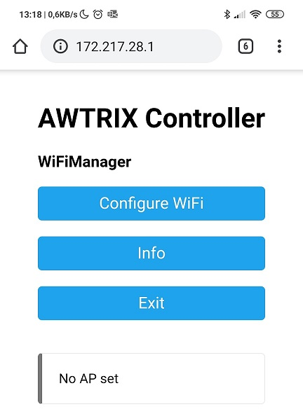
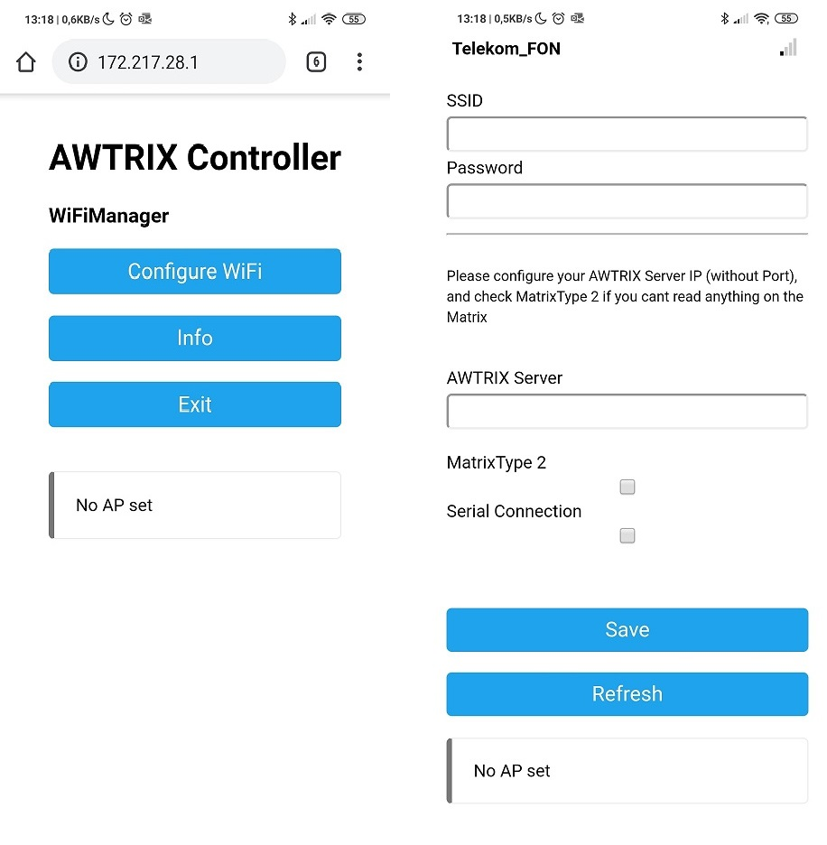

# Mortal Matrix 像素时钟

### ☕ 说明

#### 🎉 首次连接

几秒钟后，控制器将搜索已知的 WiFi 网络.

如果尚未配置Wifi连接，则矩阵上将显示文本“热点”。正如其名称所示，控制器现在将打开一个WLAN热点。对于任何WLAN设备，
现在都可以通过热点配置控制器。

+  使用SSID “Mortal Matrix” 连接到WLAN
+  WLAN密码为 “12345678”
+  如果网页没有自动打开，则可以使用任何浏览器在IP “172.217.28.1” 下导航到设置页面。此页面如下：

+ 点击“WiFi”（左图），您将进入实际设置页面（右图）。
+ 必须在提供的字段中输入 WLAN 的 SSID 和密码
+ 输入 主机IP 这是运行主机软件的设备的IP地址和通信端口。此处未指定http://或端口！
+ 1001 应保留为端口。此端口用于数据通信，不应更改。此端口与端口1000下的主机web界面无关！